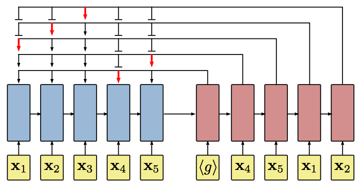

# Neural Combinatorial Optimization in Tensorflow

TensorFlow implementation of [Neural Combinatorial Optimization with Reinforcement Learning](http://arxiv.org/abs/1611.09940).

(in progress)

## Requirements

- Python 2.7
- [tqdm](https://github.com/tqdm/tqdm)
- [TensorFlow 0.12.0](https://github.com/tensorflow/tensorflow/tree/r0.12)

## Usage

(in progress)

To train a model:

    $ python main.py
    $ tensorboard --logdir=logs --host=0.0.0.0

To test a model:

    $ python main.py --is_train=False

## Results

(in progress)

## Author

Taehoon Kim / [@carpedm20](http://carpedm20.github.io)
